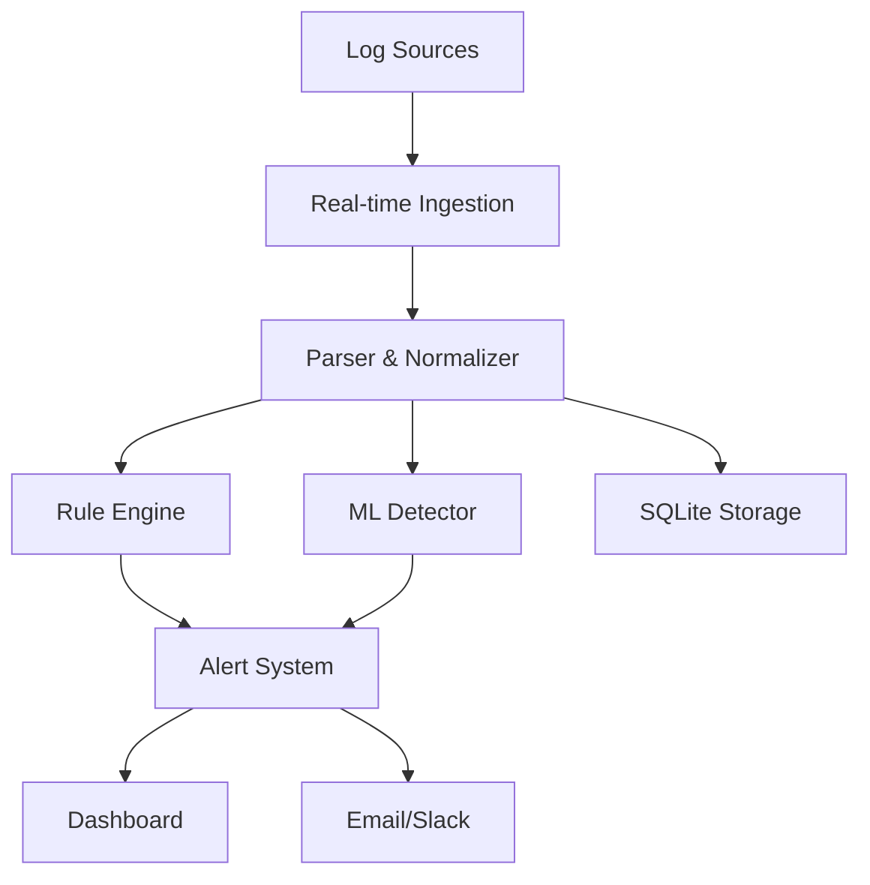

# LogGuard - Intelligent Log Analysis & Anomaly Detection

> **Self-hosted, ML-powered log monitoring that scales from startups to enterprise**

[](https://www.python.org/downloads/)
[](https://opensource.org/licenses/MIT)
[](http://makeapullrequest.com)

**LogGuard** is a production-ready, open-source alternative to expensive enterprise log monitoring solutions. Combining rule-based detection with machine learning, it identifies security threats, performance issues, and anomalies in real-time.

## Why LogGuard?

- **Privacy-First**: Your logs never leave your infrastructure
- **Dual Detection**: Rule-based + ML anomaly detection
- **Real-Time**: Continuous monitoring with sub-second alerts
- **Cost-Effective**: No per-GB pricing or vendor lock-in
- **Developer-Friendly**: Easy setup, extensible architecture
- **Visual Dashboard**: Beautiful web interface for monitoring

## What's Built & Production Ready

### Core Architecture


### Security & Monitoring Features
- **Brute Force Detection** - Identifies repeated login failures
- **Anomaly Detection** - ML-powered pattern recognition
- **Real-time Alerts** - Email notifications + file logging
- **Apache Log Parsing** - Full Common Log Format support
- **Time-Series Analysis** - Request rate and error rate tracking
- **Web Dashboard** - Live monitoring interface

### Technical Capabilities
- **Continuous Ingestion** - Real-time log file monitoring
- **Dual Storage** - Raw + normalized log storage
- **ML Pipeline** - Isolation Forest with auto-retraining
- **Configurable Rules** - Customizable detection thresholds
- **Unit Testing** - Comprehensive test coverage
- **Modular Design** - Easy to extend and customize

## Community Roadmap - Help Us Decide!

**We want to build what YOU need!** Vote on [GitHub Discussions](https://github.com/Vinayakp2001/Log-Analysis/discussions) to help prioritize features.

### High-Impact Features (Vote Now!)

#### Enhanced Security Suite
- **Geolocation Tracking** - Flag requests from unusual countries
- **Threat Intelligence** - Check IPs against known bad actor databases
- **Attack Pattern Detection** - SQL injection, XSS, path traversal detection
- **Automated Response** - Auto-block suspicious IPs
- **Session Tracking** - Detect account takeover attempts

#### Advanced Bot Detection
- **User-Agent Analysis** - Identify scrapers and automated tools
- **Behavioral Patterns** - Detect non-human request sequences
- **Rate Limiting** - Per-endpoint request throttling
- **CAPTCHA Integration** - Trigger challenges for suspicious traffic

#### API Protection Suite
- **Per-Endpoint Monitoring** - Custom rules for different API paths
- **API Key Tracking** - Monitor usage patterns by key/token
- **Coordinated Attack Detection** - Multi-IP attack identification
- **Request Payload Analysis** - Deep inspection of API calls

#### Performance & DevOps
- **Response Time Tracking** - Monitor endpoint performance
- **Deployment Correlation** - Link errors to code releases
- **Slack/PagerDuty Integration** - Real-time incident alerts
- **Custom Dashboards** - Build your own monitoring views

#### Enterprise & Compliance
- **Audit Trail Enhancement** - HIPAA, PCI-DSS compliance features
- **User Activity Tracking** - Detailed access logging
- **Advanced Reporting** - Compliance report generation
- **PostgreSQL Support** - Scale beyond SQLite

### Experimental Ideas
- **Natural Language Queries** - "Show me all failed logins from last week"
- **Predictive Analytics** - Forecast traffic patterns and capacity needs
- **Integration Marketplace** - Plugin system for custom detectors
- **Mobile App** - Monitor alerts on the go

## Real-World Use Cases

### E-commerce Protection
*"Detect inventory scrapers and card testing before they impact sales"*
- Monitor checkout flows for suspicious patterns
- Identify bot traffic on product pages
- Protect against price scraping

### Financial Services Security
*"Meet compliance requirements while catching fraud attempts"*
- Track access to sensitive customer data
- Generate audit reports for regulators
- Detect unusual transaction patterns

### SaaS Platform Monitoring
*"Keep your API healthy and catch abuse early"*
- Monitor API rate limits and usage patterns
- Detect coordinated attacks across endpoints
- Track performance degradation

### Healthcare Compliance
*"Secure patient data with comprehensive audit trails"*
- HIPAA-compliant access logging
- Detect unauthorized data access attempts
- Generate compliance reports

## Join the Community

We're building LogGuard together! Here's how you can get involved:

### Discussions & Support
- **[GitHub Issues](https://github.com/Vinayakp2001/Log-Analysis/issues)** - Bug reports and feature requests
- **[GitHub Discussions](https://github.com/Vinayakp2001/Log-Analysis/discussions)** - Questions, ideas, and showcase

### Contributing
- **Good First Issues** - Perfect for new contributors
- **Feature Voting** - Help prioritize the roadmap
- **Documentation** - Improve guides and examples
- **Testing** - Try LogGuard in your environment and share feedback


## Quick Start (5 Minutes)

### 1. Clone & Setup
```bash
git clone https://github.com/Vinayakp2001/Log-Analysis.git
cd Log-Analysis

# Create virtual environment
python -m venv venv
source venv/bin/activate  # On Windows: venv\Scripts\activate

# Install dependencies
pip install -r requirements.txt
```

### 2. Generate Demo Data
```bash
cd src
python generate_logs.py  # Creates sample Apache logs
```

### 3. Start LogGuard
```bash
# Terminal 1: Start log ingestion & rule-based detection
python log_ingestor.py

# Terminal 2: Start ML-based detection service
python ml_detector_service.py

# Terminal 3: Start web dashboard
python app.py
```

### 4. View Dashboard
Open http://localhost:5000 to see:
- Real-time anomaly counts
- Recent alerts and logs
- Detailed anomaly analysis

### 5. Configure for Your Logs
```python
# Edit src/config.py
LOG_FILE_PATH = "/var/log/apache2/access.log"  # Your actual log file
RULE_ENGINE_ERROR_THRESHOLD = 5               # Adjust for your traffic
EMAIL_ALERTS_ENABLED = True                   # Enable notifications
```

## Documentation

Currently, the main documentation is in this README. Additional documentation will be added based on community needs and contributions.

## What Users Could Achieve

### Potential Security Benefits
*"Catch credential stuffing attacks that traditional solutions miss"*
- Early detection of brute force attempts
- Automated alerting for suspicious patterns
- Reduced security incident response time

### Cost Savings Scenarios
*"Replace expensive enterprise licenses with self-hosted solution"*
- Zero per-GB pricing compared to $3,000+/month for enterprise tools
- No vendor lock-in or licensing restrictions
- Full control over your log data

### Performance Insights
*"Discover performance issues through ML-powered analysis"*
- Identify slow endpoints and bottlenecks
- Detect unusual traffic patterns
- Optimize based on real usage data

**Want to share your LogGuard success story?** We're looking for users to test LogGuard and share their experiences. Please try it out and let us know how it works for your use case via [GitHub Issues](https://github.com/Vinayakp2001/Log-Analysis/issues) or [Discussions](https://github.com/Vinayakp2001/Log-Analysis/discussions).

## Advantages Over Enterprise Solutions

### Key Benefits
- **Quick Setup**: 5-minute installation vs days of enterprise configuration
- **Zero Cost**: No per-GB pricing or licensing fees
- **Fast Detection**: Real-time processing vs delayed batch analysis
- **Low Resource Usage**: Lightweight Python application
- **Easy Learning Curve**: Simple configuration and intuitive interface
- **Full Control**: Self-hosted with complete data ownership

*Performance benchmarks will be added as we gather real-world usage data from the community.*

## Security & Privacy

- **Self-Hosted**: Your logs never leave your infrastructure
- **No Telemetry**: Zero data collection or phone-home
- **Secure by Default**: Minimal attack surface
- **Compliance Ready**: GDPR, HIPAA, SOC2 compatible

## Contributing

We love contributions! Here's how to get started:

### Found a Bug?
1. Check [existing issues](https://github.com/Vinayakp2001/Log-Analysis/issues)
2. Create a detailed bug report
3. Include logs and reproduction steps

### Have a Feature Idea?
1. Check the [roadmap](#community-roadmap---help-us-decide) above
2. Start a [discussion](https://github.com/Vinayakp2001/Log-Analysis/discussions)
3. Get community feedback before coding

### Ready to Code?
1. Fork the repository
2. Create a feature branch
3. Add tests for your changes
4. Submit a pull request

### Improve Documentation?
- Fix typos and unclear explanations
- Add examples and use cases
- Translate to other languages

## License

LogGuard is released under the [MIT License](LICENSE). Use it freely in personal and commercial projects.

## 🙏 Acknowledgments

Built with ❤️ by [Vinayak Parth](https://github.com/Vinayakp2001) using the amazing Python ecosystem.

---

**Star this repo if LogGuard helps you!** It helps others discover the project.

